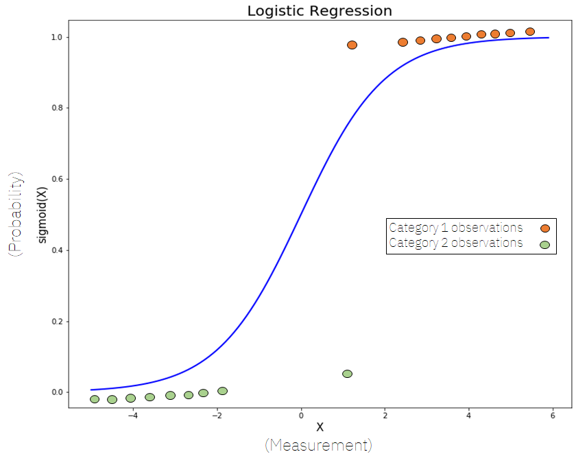
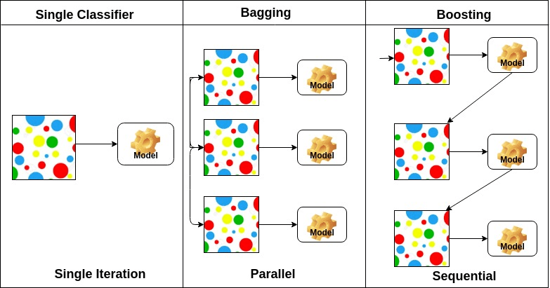

# Notes

## Algorithms Explained

### KNN

duh

### Decision Tree

duh

### Random forest

- A composite model (made of many decision trees)
- Each tree predicts the possible label. 
- The label with the most votes is chosen.

### Logistic Regression

 

- Creates a sigmoid function using the data given in the dataset in relation to its labels.
- It predicts values by seeing which label it's closer to.

### SVM

- It attempts to create the best boundary that would differentiate between the data correctly.
- This boundary is `n`-dimensional where `n` is the number of features that exist on the dataset.

### Gaussian Naive Bayes

- It uses Gaussian (Normal) distribution to predict the likelihood of an observation to have a certain label.
- The label with the highest probability is chosen.

### Ada Boost

- A composite model (made of many low-performing classifiers)
- It creates models based on its given classifiers.
- These models are then used to boost each other for more accurate results.

## Performance Measures

### AUC (area under curve)

- The measure of the ability of a classifier to distinguish between classes.

### CA (classification accuracy)

- your usual accuracy.
- right guesses divided by all guesses.

### Recall

- It is the number of correct positive results divided by the number of all samples that should have been identified as positive.

### Precision

- It is the number of correct positive results divided by the number of positive results predicted by the classifier.

### F1

- The harmonic mean between precision and recall.
- It takes the proportion of missed guesses into account to show how robust and precise the classifier is.
